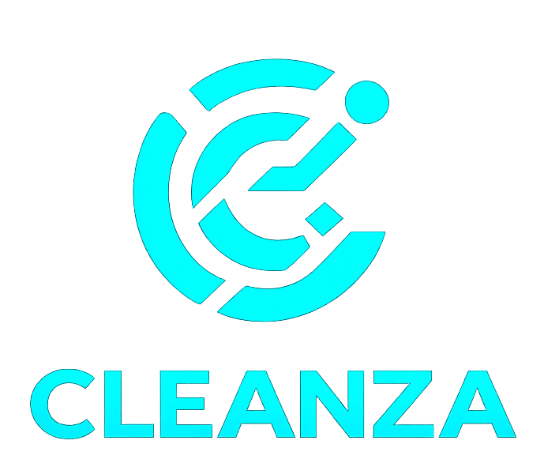

# Cleanza CMS

<p align="center">
  
</p>

<h1 align="center">Cleanza CMS</h1>

<p align="center">
  High-Performance CMS & Workflow Management Platform
</p>

<p align="center">
  Built for large-scale educational and operational data workflows.
</p>

---

## Overview

Cleanza is a scalable CMS platform engineered to handle high-volume datasets, workflow automation, and operational management efficiently. The system is designed with a strong focus on performance, maintainability, and real-world administrative workflows.

Built using a modular FastAPI backend and a responsive frontend architecture, Cleanza streamlines analytics, reporting, bulk data operations, and large dataset management through a modern desktop-inspired interface.

---

## Features

- Chunk-based Excel & CSV processing
- Large-scale dataset handling
- Bulk filtering and record operations
- Analytics and reporting modules
- FastAPI-powered backend services
- Responsive admin dashboard UI
- Export and workflow utilities
- Optimized memory-efficient processing
- Modular and scalable architecture

---

## Tech Stack

### Backend
- Python
- FastAPI
- Pandas

### Frontend
- HTML5
- CSS3
- JavaScript
- Bootstrap
- Chart.js

---

## Project Structure

```bash
Cleanza/
│
├── backend/
│   ├── app/
│   ├── cleanza_venv/
│   ├── temp_uploads/
│   ├── .env
│   └── requirements.txt
│
├── frontend/
│   ├── assets/
│   ├── css/
│   ├── js/
│   ├── node_modules/
│   ├── index.html
│   ├── package.json
│   └── vite.config.js
│
├── storage/
├── temp_uploads/
└── README.md
```

---

## Installation

### Clone Repository

```bash
git clone https://github.com/EzioAman/Cleanza.git
cd Cleanza
```

---

### Backend Setup

```bash
cd backend
pip install -r requirements.txt
```

Run backend server:

```bash
uvicorn app.main:app --reload
```

---

### Frontend Setup

```bash
cd frontend
npm install
npm run dev
```

---

## Design Goals

- Scalable system architecture
- Clean modular structure
- Efficient memory utilization
- Production-oriented workflows
- Fast dataset operations
- Maintainable codebase

---

## Status

```bash
Active Development
```

---

## License

This project is currently private and maintained for development purposes.
